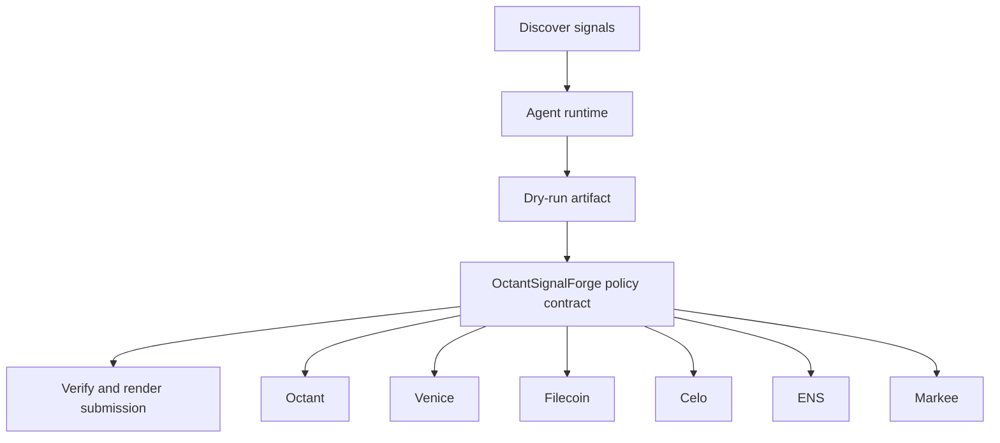

# Octant Signal Forge

- **Repo:** `Synthesis-Octant`
- **Primary track:** Octant Public Goods
- **Category:** public_goods
- **Submission status:** implementation ready, waiting for credentials and TxIDs.

A signal forge that aggregates messy qualitative inputs, converts them into explainable scores, and prepares faster DPI allocation plans.

## Selected concept

The project aggregates messy qualitative inputs, converts them into explainable scores, and prepares public-goods allocation plans. The contract stores round parameters and proof commitments while Python collectors and scorers keep a verifiable audit trail.

## Idea shortlist

1. Faster DPI Scoring Swarm
2. Qualitative Impact Evidence Engine
3. Private Grant Ranking Desk

## Partners covered

Octant, Venice, Filecoin, Celo, ENS, Markee

## Architecture



## Repository layout

- `src/`: shared policy contracts plus the repo-specific wrapper contract.
- `script/`: Foundry deployment entrypoint.
- `agents/`: Python runtime, partner adapters, and project metadata.
- `scripts/`: CLI utilities for running the loop and rendering submissions.
- `docs/`: architecture, credentials, demo script, and security notes.
- `submissions/`: generated `synthesis.md` snippet for this repo.

## Action catalog

| Action | Partner | Purpose | Max USD | Sensitivity |
| --- | --- | --- | --- | --- |
| `octant_signal_publish` | Octant | Use Octant for a bounded action in this repo. | $25 | medium |
| `venice_private_analysis` | Venice | Use Venice for a bounded action in this repo. | $5 | high |
| `filecoin_proof_store` | Filecoin | Use Filecoin for a bounded action in this repo. | $20 | medium |
| `celo_payment_settle` | Celo | Use Celo for a bounded action in this repo. | $150 | low |
| `ens_ens_publish` | ENS | Use ENS for a bounded action in this repo. | $5 | low |
| `markee_repo_message` | Markee | Use Markee for a bounded action in this repo. | $5 | low |

## Commands

```bash
python3 -m unittest discover -s tests
forge test
python3 scripts/run_agent.py
python3 scripts/plan_live_demo.py
python3 scripts/render_submission.py
```

## Credentials

| Partner | Variables | Docs |
| --- | --- | --- |
| Octant | OCTANT_SIGNAL_URL | https://octant.app/ |
| Venice | VENICE_API_KEY, VENICE_CHAT_COMPLETIONS_URL, VENICE_MODEL | https://docs.venice.ai/ |
| Filecoin | FILECOIN_API_TOKEN, FILECOIN_UPLOAD_URL | https://docs.filecoin.cloud/ |
| Celo | CELO_RPC_URL | https://docs.celo.org/ |
| ENS | ENS_NAME | https://docs.ens.domains/ |
| Markee | MARKEE_API_KEY, MARKEE_MESSAGE_URL | https://markee.xyz/ |

## Live demo plan

1. Copy .env.example to .env and fill the required keys.
2. Deploy the contract with forge script script/Deploy.s.sol --broadcast for OctantSignalForge.
3. Run python3 scripts/run_agent.py to produce a dry run for octant_signal_forge.
4. Set LIVE_MODE=true and rerun python3 scripts/run_agent.py with real credentials.
5. Run python3 scripts/render_submission.py and attach TxIDs plus repo links.
