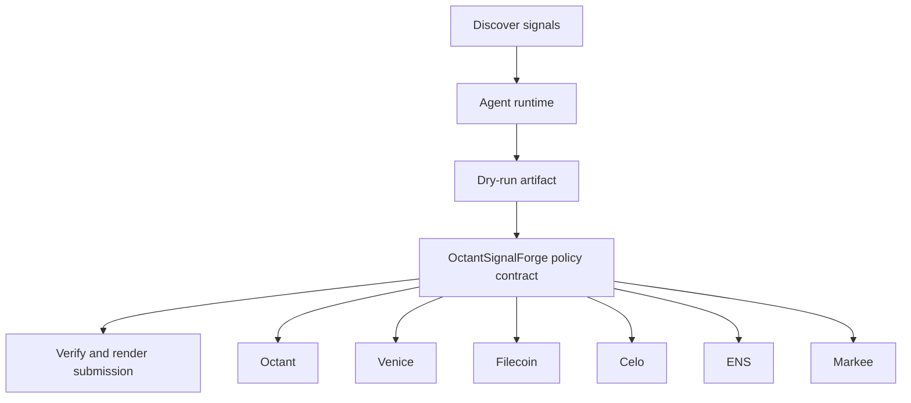

# Octant Signal Forge

- **Repo:** [Synthesis-Octant](https://github.com/CrystallineButterfly/Synthesis-Octant)
- **Primary track:** Octant Public Goods
- **Category:** public_goods
- **Primary contract:** `OctantSignalForge`
- **Primary module:** `octant_signal_forge`
- **Submission status:** audited and offline-demo ready; optional live partner credentials unlock network execution.

## What this repo does

A signal forge that aggregates messy qualitative inputs, converts them into explainable scores, and prepares faster DPI allocation plans.

## Why this build matters

The project aggregates messy qualitative inputs, converts them into explainable scores, and prepares public-goods allocation plans. The contract stores round parameters and proof commitments while Python collectors and scorers keep a verifiable audit trail.

## Submission fit

- **Primary track:** Octant Public Goods
- **Overlap targets:** Venice Private Agents, Filecoin, Celo, ENS, YieldGuard, Markee
- **Partners covered:** Octant, Venice, Filecoin, Celo, ENS, Markee

## Idea shortlist

1. Faster DPI Scoring Swarm
2. Qualitative Impact Evidence Engine
3. Private Grant Ranking Desk

## System graph



## Repository contents

| Path | What it contains |
| --- | --- |
| `src/` | Shared policy contracts plus the repo-specific wrapper contract. |
| `script/Deploy.s.sol` | Foundry deployment entrypoint for the policy contract. |
| `agents/` | Python runtime, project spec, env handling, and partner adapters. |
| `scripts/` | Terminal entrypoints for run, demo planning, and submission rendering. |
| `docs/` | Architecture, credentials, security notes, and demo steps. |
| `submissions/` | Generated `synthesis.md` snippet for this repo. |
| `test/` | Foundry tests for the Solidity control layer. |
| `tests/` | Python tests for runtime and project context. |
| `agent.json` | Submission-facing agent manifest. |
| `agent_log.json` | Local execution log and status trail. |

## Autonomy loop

1. Discover signals relevant to the repo track and its overlap targets.
2. Build a bounded plan with per-action and compute caps.
3. Persist a dry-run artifact before any live execution.
4. Enforce onchain policy through the guarded contract wrapper.
5. Verify outputs, update receipts, and render submission material.

## Current readiness

- **Latest verification:** `verified` at `2026-03-19T03:52:16+00:00`
- **Execution mode:** `offline_prepared`
- **Offline-prepared partners:** Filecoin (prepared_filecoin_bundle), Celo (prepared_contract_call), ENS (prepared_contract_call)
- **Live credential blockers:** Octant, Venice, Markee
- **Audit docs:** `docs/audit.md`, `docs/live_readiness.md`

## Most sensitive actions

- `venice_private_analysis` (Venice, high)

## Live blocker details

- **Octant** — OCTANT_SIGNAL_URL — https://octant.app/
- **Venice** — VENICE_API_KEY, VENICE_CHAT_COMPLETIONS_URL, VENICE_MODEL — https://docs.venice.ai/
- **Markee** — MARKEE_API_KEY, MARKEE_MESSAGE_URL — https://markee.xyz/

## Latest evidence artifacts

- `artifacts/filecoin/0x11ef2a19b8c52a013a60d97fdf1bf0845f7d56dc7040ce6fd134107ccfb97d88.json`
- `artifacts/onchain_intents/celo_payment_settle.json`
- `artifacts/onchain_intents/ens_ens_publish.json`

## Security controls

- Admin-managed allowlists for targets and selectors.
- Per-action caps, daily caps, cooldown windows, and a principal floor.
- Reporter-only receipt anchoring and proof attachment.
- Env-only secrets; no committed private keys or partner tokens.
- Pause switch plus dry-run-first execution flow.

## Action catalog

| Action | Partner | Purpose | Max USD | Sensitivity |
| --- | --- | --- | --- | --- |
| `octant_signal_publish` | Octant | Use Octant for a bounded action in this repo. | $25 | medium |
| `venice_private_analysis` | Venice | Use Venice for a bounded action in this repo. | $5 | high |
| `filecoin_proof_store` | Filecoin | Use Filecoin for a bounded action in this repo. | $20 | medium |
| `celo_payment_settle` | Celo | Use Celo for a bounded action in this repo. | $150 | low |
| `ens_ens_publish` | ENS | Use ENS for a bounded action in this repo. | $5 | low |
| `markee_repo_message` | Markee | Use Markee for a bounded action in this repo. | $5 | low |

## Local terminal flow (Anvil + Sepolia)

```bash
export SEPOLIA_RPC_URL=https://sepolia.infura.io/v3/YOUR_KEY
anvil --fork-url "$SEPOLIA_RPC_URL" --chain-id 11155111
cp .env.example .env
# keep private keys only in .env; TODO.md stays local-only too
forge script script/Deploy.s.sol --rpc-url "$RPC_URL" --broadcast
python3 scripts/run_agent.py
python3 scripts/render_submission.py
```

## Commands

```bash
python3 -m unittest discover -s tests
forge test
python3 scripts/run_agent.py
python3 scripts/plan_live_demo.py
python3 scripts/render_submission.py
```

## Credentials

| Partner | Variables | Docs |
| --- | --- | --- |
| Octant | OCTANT_SIGNAL_URL | https://octant.app/ |
| Venice | VENICE_API_KEY, VENICE_CHAT_COMPLETIONS_URL, VENICE_MODEL | https://docs.venice.ai/ |
| Filecoin | FILECOIN_API_TOKEN, FILECOIN_UPLOAD_URL | https://docs.filecoin.cloud/ |
| Celo | CELO_RPC_URL | https://docs.celo.org/ |
| ENS | ENS_NAME | https://docs.ens.domains/ |
| Markee | MARKEE_API_KEY, MARKEE_MESSAGE_URL | https://markee.xyz/ |

## Live demo plan

1. Copy .env.example to .env and fill the required keys.
2. Deploy the contract with forge script script/Deploy.s.sol --broadcast for OctantSignalForge.
3. Run python3 scripts/run_agent.py to produce a dry run for octant_signal_forge.
4. Set LIVE_MODE=true and rerun python3 scripts/run_agent.py with real credentials.
5. Run python3 scripts/render_submission.py and attach TxIDs plus repo links.
